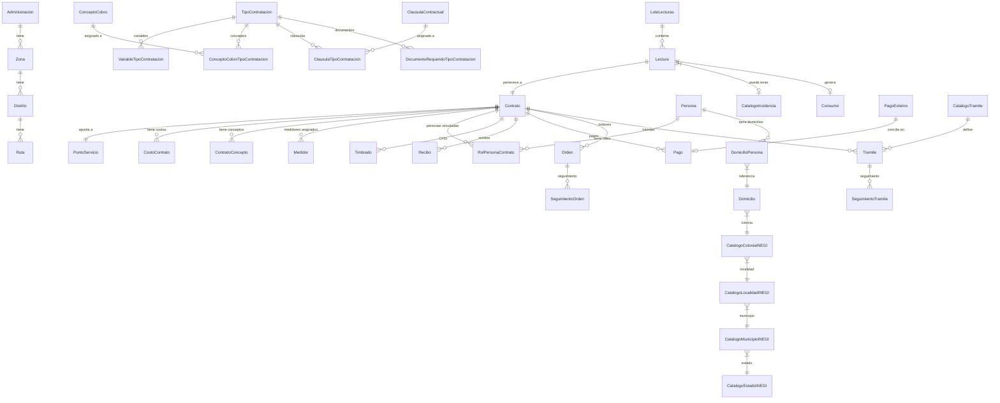
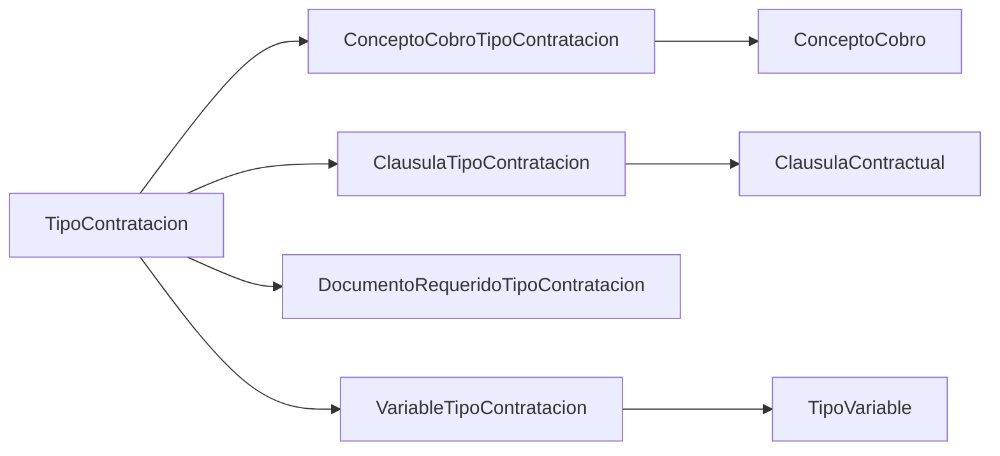

# HYDRA — Modelo de Datos

> 51 modelos Prisma organizados en 17 dominios — 2026-05-06

---

## Diagrama de Relaciones Principales

El diagrama muestra los 10 dominios más importantes y sus relaciones estructurales.



---

## Dominios y Modelos

### 1. TERRITORIAL

Estructura geográfica-administrativa de la organización.

| Modelo | Descripción |
|---|---|
| `Administracion` | Unidad administrativa raíz (organismo operador) |
| `Zona` | Agrupación de distritos bajo una administración |
| `Distrito` | Unidad operativa de campo con rutas asignadas |
| `Ruta` | Secuencia de lectura de medidores |

**Jerarquía:** `Administracion → Zona → Distrito → Ruta`

---

### 2. OBRAS

Infraestructura física relacionada con la toma de agua.

| Modelo | Descripción |
|---|---|
| `Factibilidad` | Estudio de viabilidad técnica para una nueva conexión |
| `Construccion` | Proyecto de obra asociado al contrato |
| `Toma` | Toma de agua física instalada en campo |

---

### 3. CONTRATOS CORE

Núcleo del sistema. Representa la relación contractual entre el organismo y el usuario.

| Modelo | Descripción |
|---|---|
| `Contrato` | Contrato de suministro de agua |
| `CostoContrato` | Costo histórico/vigente asociado al contrato |
| `ContratoConcepto` | Conceptos de cobro activos en el contrato |
| `Medidor` | Medidor actualmente instalado en el contrato |
| `MedidorBodega` | Medidores en inventario (sin asignar) |

**Campos clave de `Contrato`:**

```
id                  String
numero              String          -- número de contrato legible
estado              String          -- Activo | Cortado | BajaTemp | BajaDef | Pendiente de alta
administracionId    String
tipoContratacionId  String
puntoServicioId     String
zonaFacturacionId   String?
fechaAlta           DateTime?
adeudo              Decimal
bloqueado           Boolean         -- bloqueo jurídico
```

---

### 4. PERSONAS

Gestión de personas físicas y morales vinculadas a contratos.

| Modelo | Descripción |
|---|---|
| `Persona` | Persona física o moral (propietario, representante, etc.) |
| `RolPersonaContrato` | Rol de una persona en un contrato (propietario, fiscal, contacto) |
| `DomicilioPersona` | Asociación entre persona y domicilio con rol (fiscal, notificación) |

**Campos clave de `Persona`:**

```
id              String
tipoPersona     String          -- FISICA | MORAL
rfc             String
curp            String?
razonSocial     String?
nombre          String?
apellidoPat     String?
apellidoMat     String?
regimenFiscalId String?         -- FK a CatalogoSat (REGIMEN_FISCAL)
```

---

### 5. INEGI / DOMICILIOS

Catálogos de INEGI para estandarizar domicilios en cuatro niveles jerárquicos.

| Modelo | Descripción |
|---|---|
| `Domicilio` | Domicilio normalizado con referencia a catálogos INEGI |
| `CatalogoEstadoINEGI` | Catálogo de estados (32) |
| `CatalogoMunicipioINEGI` | Catálogo de municipios |
| `CatalogoLocalidadINEGI` | Catálogo de localidades |
| `CatalogoColoniaINEGI` | Catálogo de colonias con código postal |

**Origen:** Descarga oficial INEGI, importada mediante seed controlado.

**Jerarquía de selección en UI:**
```
Estado → Municipio → Localidad → Colonia (+ CP)
```

---

### 6. TIPOS DE CONTRATACIÓN

Parametrización de los diferentes tipos de conexión. Permite que el administrador configure el comportamiento sin modificar código.

| Modelo | Descripción |
|---|---|
| `TipoContratacion` | Tipo de servicio (doméstico, comercial, industrial, etc.) |
| `VariableTipoContratacion` | Variables dinámicas requeridas por este tipo |
| `TipoVariable` | Definición de una variable (nombre, tipo de dato, validaciones) |
| `ConceptoCobro` | Concepto de cobro maestro (clave, descripción, tipo de cálculo) |
| `ConceptoCobroTipoContratacion` | Asignación de un concepto de cobro a un tipo (tabla N:N parametrizada) |
| `ClausulaContractual` | Texto versionado de una cláusula |
| `ClausulaTipoContratacion` | Asignación de cláusula a tipo de contratación |
| `DocumentoRequeridoTipoContratacion` | Documentos que el cliente debe entregar para este tipo |
| `ClaseContrato` | Clase de proceso: `AN`, `CN`, `PB`, `BJ` |
| `CatalogoTipoRelacionPS` | Tipos de relación entre contrato y punto de servicio |

**Campos clave de `TipoContratacion`:**

```
id                      String
nombre                  String
claseContratoId         String
requiereInspeccion      Boolean
requiereMedidor         Boolean
requiereSolicitudPrevia Boolean
```

**Tipos de dato de `TipoVariable`:**

```
TEXTO | NUMERO | FECHA | BOOLEANO | LISTA
```

---

### 7. PUNTO DE SERVICIO

Representa la ubicación física donde se presta el servicio de agua.

| Modelo | Descripción |
|---|---|
| `PuntoServicio` | Punto de entrega/medición del suministro |
| `CatalogoTipoSuministro` | Tipo de suministro (agua potable, saneamiento, etc.) |
| `CatalogoEstructuraTecnica` | Estructura de red hidráulica asociada |
| `CatalogoZonaFacturacion` | Zona tarifaria para asignación de tasas |
| `CatalogoCodigoRecorrido` | Código de ruta de lectura |
| `CatalogoTipoCorte` | Tipo de corte aplicable al punto |

---

### 8. LECTURAS / CONSUMOS

Ciclo de lectura de medidores y cálculo de consumo.

| Modelo | Descripción |
|---|---|
| `LoteLecturas` | Archivo de lecturas cargado por un operador (estado: `Pendiente`) |
| `Lectura` | Lectura individual de medidor |
| `CatalogoIncidencia` | Catálogo de incidencias de lectura (medidor dañado, inaccesible, etc.) |
| `Lecturista` | Persona que realiza la toma de lecturas en campo |
| `Contratista` | Empresa contratista que gestiona lecturistas |
| `MensajeLecturista` | Comunicación entre operador y lecturista sobre una lectura |
| `Consumo` | Consumo calculado a partir de dos lecturas consecutivas |

**Campos clave de `Lectura`:**

```
id              String
contratoId      String
loteId          String
lecturista      String
fechaLectura    DateTime
lecturaAnterior Decimal
lecturaActual   Decimal
incidenciaId    String?
confirmado      Boolean         -- true = listo para prefacturación
fotoBase64      String?
```

---

### 9. FACTURACIÓN / PAGOS

Generación de comprobantes fiscales y registro de pagos.

| Modelo | Descripción |
|---|---|
| `Timbrado` | CFDI generado y timbrado ante el SAT |
| `Recibo` | Recibo de cobro descargable (no necesariamente CFDI) |
| `Pago` | Pago aplicado al saldo del contrato |
| `PagoExterno` | Pago recibido del banco antes de conciliar |
| `Convenio` | Convenio de pago a plazos acordado con el cliente |
| `Anticipo` | Anticipo registrado a cuenta del contrato |
| `SesionCaja` | Corte de caja de un agente de cobro |
| `FormaPago` | Catálogo de formas de pago (efectivo, transferencia, etc.) |
| `MensajeRecibo` | Mensaje personalizable impreso en el recibo |

**Campos clave de `PagoExterno`:**

```
id              String
banco           String          -- OXXO | BBVA | BANORTE | HSBC | SANTANDER | CITYBANAMEX | CSV
referencia      String
monto           Decimal
fechaPagoReal   DateTime        -- fecha efectiva del cliente
estado          String          -- pendiente_conciliar | rechazado
motivoRechazo   String?
pagoId          String?         -- FK a Pago (si fue conciliado)
```

**Estados de `Timbrado`:**

```
Timbrada OK | Error PAC | Pendiente
```

---

### 10. ÓRDENES

Gestión de órdenes de trabajo generadas durante el proceso de contratación y operación.

| Modelo | Descripción |
|---|---|
| `Orden` | Orden de trabajo (instalación de toma, medidor, mantenimiento, etc.) |
| `SeguimientoOrden` | Bitácora de avance de la orden con responsable y fecha |

---

### 11. QUEJAS / ACLARACIONES

Gestión de atención a clientes y tickets de soporte.

| Modelo | Descripción |
|---|---|
| `QuejaAclaracion` | Queja o aclaración presentada por un cliente |
| `SeguimientoQueja` | Seguimiento de la queja con respuestas y cambios de estado |
| `AgoraTicket` | Ticket de soporte integrado con plataforma externa Agora |

---

### 12. TRÁMITES

Solicitudes formales que modifican el estado del contrato.

| Modelo | Descripción |
|---|---|
| `Tramite` | Instancia de un trámite iniciado por un cliente |
| `SeguimientoTramite` | Bitácora de avance del trámite |
| `Documento` | Documento digital adjunto a un trámite o solicitud |
| `CatalogoTramite` | Catálogo maestro de trámites disponibles |
| `HistoricoContrato` | Registro de cambios históricos al contrato (nombre, dirección, etc.) |

---

### 13. CONTABILIDAD

Integración contable de las transacciones del sistema.

| Modelo | Descripción |
|---|---|
| `ReglaContable` | Regla que define cómo generar una póliza para un evento |
| `Poliza` | Póliza contable generada |
| `LineaPoliza` | Línea de asiento contable (debe / haber) |

---

### 14. GIS

Sincronización de datos con sistemas de información geográfica.

| Modelo | Descripción |
|---|---|
| `LogSincronizacion` | Registro de sincronizaciones con capa GIS externa |
| `CambioGIS` | Cambio detectado en la capa GIS que afecta un contrato o toma |

---

### 15. MOTOR TARIFARIO

Gestión de tarifas vigentes y sus correcciones.

| Modelo | Descripción |
|---|---|
| `Tarifa` | Tarifa vigente con rango de fechas y valores por bloque |
| `CorreccionTarifaria` | Corrección aplicada retroactivamente a una tarifa |
| `AjusteTarifario` | Ajuste por factor de actualización (INPC u otro) |
| `ActualizacionTarifaria` | Proceso formal de actualización de tarifas |

---

### 16. CATÁLOGOS DE MEDIDORES

Referencia para el inventario y asignación de medidores.

| Modelo | Descripción |
|---|---|
| `CatalogoMarcaMedidor` | Marcas de medidores (Itron, Sensus, etc.) |
| `CatalogoModeloMedidor` | Modelos por marca |
| `CatalogoCalibre` | Calibres disponibles (1/2", 3/4", 1", etc.) |
| `CatalogoEmplazamiento` | Ubicación del medidor (banqueta, interior, fosa, etc.) |
| `CatalogoTipoContador` | Tipo de contador (volumétrico, velocidad, electromagnético) |

---

### 17. CATÁLOGOS GENERALES

| Modelo | Descripción |
|---|---|
| `CatalogoActividad` | Actividad económica del usuario |
| `CatalogoGrupoActividad` | Agrupación de actividades económicas |
| `CatalogoCategoria` | Categoría tarifaria |
| `CatalogoSat` | Catálogos SAT: régimen fiscal y uso de CFDI |
| `TipoOficina` | Tipo de oficina (central, sucursal, caja) |
| `Oficina` | Oficina física de atención o cobro |
| `SectorHidraulico` | Sector de la red hidráulica |
| `TipoVia` | Tipo de vía pública (calle, avenida, boulevard, etc.) |

---

## Enumeraciones (Enums)

### `UserRole`

```
SUPER_ADMIN       -- acceso total
ADMIN             -- administrador de organismo
OPERADOR          -- operación diaria
LECTURISTA        -- captura de lecturas (móvil)
ATENCION_CLIENTES -- módulo de atención
CLIENTE           -- acceso al portal de cliente
```

### `CatalogoSatTipo`

```
REGIMEN_FISCAL    -- regímenes del SAT (e.g., 612 - Personas Físicas con Actividades)
USO_CFDI          -- usos de CFDI (e.g., G03 - Gastos en general)
```

**Origen:** Catálogo oficial SAT, importado como seed controlado.

---

## Relaciones N:N Parametrizadas

Estas tablas intermedias no son simples joins: contienen configuración propia que determina el comportamiento del sistema.



| Tabla N:N | Configuración adicional |
|---|---|
| `ConceptoCobroTipoContratacion` | Orden de aplicación, si es obligatorio, override de fórmula |
| `ClausulaTipoContratacion` | Versión de la cláusula activa para este tipo |
| `DocumentoRequeridoTipoContratacion` | Si el documento es obligatorio o condicionado |
| `VariableTipoContratacion` | Valor por defecto, si es requerido, orden en UI |

---

## Catálogos por Origen

| Origen | Catálogos |
|---|---|
| **INEGI** | `CatalogoEstadoINEGI`, `CatalogoMunicipioINEGI`, `CatalogoLocalidadINEGI`, `CatalogoColoniaINEGI` |
| **SAT** | `CatalogoSat` (tipos: `REGIMEN_FISCAL`, `USO_CFDI`) |
| **SIGE** | `CatalogoActividad`, `CatalogoGrupoActividad`, `CatalogoCategoria`, `CatalogoMarcaMedidor`, `CatalogoModeloMedidor` |
| **Seed interno** | `TipoOficina`, `ClaseContrato`, `CatalogoIncidencia`, `CatalogoTramite`, `FormaPago`, `TipoVia` |

---

## Estados del Sistema (Referencia Rápida)

### Solicitud (campo `estado` en `string`)

```
inspeccion_pendiente
    └─ en_cotizacion
           └─ aceptada
                 └─ contratado
           └─ rechazada
           └─ cancelada
```

### ProcesoContratacion (campo `etapa`)

```
solicitud → factibilidad → contrato → instalacion_toma → instalacion_medidor → alta
```

### Contrato (campo `estado`)

```
Pendiente de alta → Activo → Cortado → BajaTemp → BajaDef
```

### LoteLecturas (campo `estado`)

```
Pendiente → Validado → Rechazado
```

### PagoExterno (campo `estado`)

```
pendiente_conciliar → [conciliado] (se crea Pago)
pendiente_conciliar → rechazado   (motivo registrado)
```

### Timbrado (campo `estado`)

```
Pendiente → Timbrada OK
Pendiente → Error PAC
```
