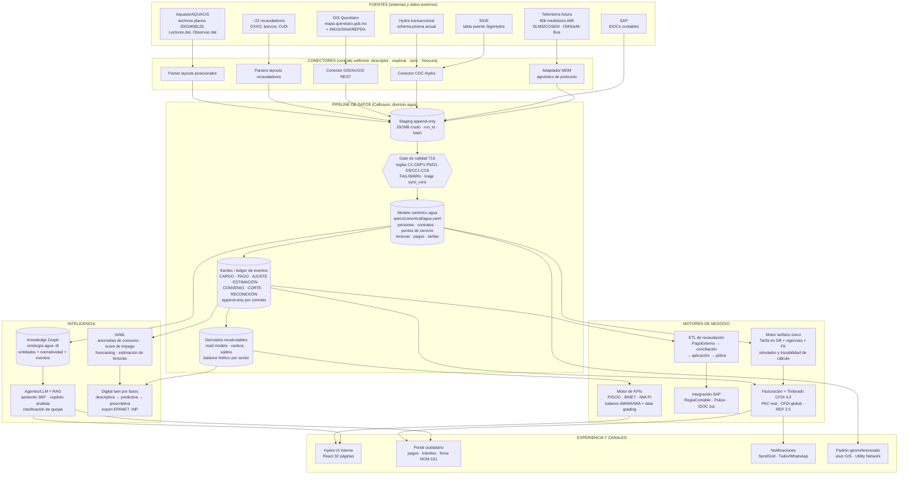

# 08 — Arquitectura conceptual de la plataforma Hydra

*Generado 2026-07-17. Entregable 11 del plan (`PROMPT-INVESTIGACION-PLAN-HYDRA.md`). Basado en el diagnóstico del repo (doc 01), el benchmark SWAN (doc 02) y el ecosistema nacional (doc 03).*

---

## 1. Visión

Hydra evoluciona de un **CIS monolítico contract-to-cash** (NestJS 33 módulos + React 32 páginas + PostgreSQL ~70 modelos Prisma) a una **plataforma de datos comercial-operativa AI-native**, donde el activo central no son los módulos sino el **modelo canónico del dominio agua (Callosum)** y el **kardex de eventos comerciales**, de los cuales todo lo demás (KPIs, facturación, IA, Knowledge Graph, digital twin) se deriva de forma auditable.

El patrón es el mismo probado en Katastik (catastro) y SEDESU (impacto ambiental): **fuentes → staging append-only → canónico → ledger de eventos → derivados**, con calidad declarativa como gate de publicación.

---

## 2. Diagrama de arquitectura conceptual

---

## 3. Piezas y su posición en las 5 capas SWAN

| Capa SWAN | Definición | Piezas de Hydra | Estado |
|---|---|---|---|
| **1. Física** | Tuberías, tomas, medidores, válvulas | `Toma`/`PuntoServicio`, `Medidor`, `SectorHidraulico` — solo su **representación digital** (Hydra no opera activos físicos) | Padrón parcial; red hidráulica no modelada |
| **2. Sensado y control** | Sensores, medidores inteligentes | 80k medidores nuevos de la CEA (proyecto externo); `Medidor.tipoTelemetria` es el único gancho hoy | Futuro — exige capa MDM |
| **3. Recolección y comunicaciones** | Transporte de datos | Conectores del pipeline: parser AQUACIS (T01), parsers de ~22 recaudadores (T02), ArcGIS REST, IDOC SAP, adaptador MDM (DLMS/COSEM, OMS/wM-Bus, LoRaWAN/NB-IoT) | Parcial (archivos planos); MDM inexistente |
| **4. Gestión y visualización** | Sistemas empresariales, GIS, SCADA | **Aquí vive Hydra hoy**: los 33 módulos NestJS, UI React, motor tarifario, facturación, caja, órdenes, portal, GIS CDC (`gis-tracker.service.ts`) | Núcleo del sistema actual |
| **5. Fusión y análisis** | Analítica, IA/ML, digital twins | **Hacia donde evoluciona**: motor de KPIs, detección de anomalías, score de impago, forecasting, Knowledge Graph, agentes/RAG, balance hídrico por sector, export EPANET | No existe — es el diferencial del plan |

**Tesis arquitectónica:** el puente entre la capa 4 y la capa 5 es el **pipeline canónico + kardex**. Sin él, cada iniciativa de analítica/IA tendría que leer directamente las tablas transaccionales (fechas `String`, JSONB sin schema, dos motores de tarifa) y heredaría toda su deuda. Con él, la capa 5 consume datos ya normalizados, versionados y con linaje.

---

## 4. Descripción de componentes

### 4.1 Modelo canónico Callosum (dominio `agua`)
- `specs/sources/agua/{aquasis,sige,hydra,recaudadores,sap_idoc,inegi_marco,conagua_sina,pigoo,arcgis_queretaro}.yaml` — perfiles de fuente.
- `specs/canonical/agua.yaml` — síntesis adoptando estándares: SWAN layers (arquitectura), IWA PI/IBNET/PIGOO (indicadores), balance IWA/AWWA, WaterML 2.0 / OGC SensorThings (series de tiempo), GWML2 (pozos/acuíferos), EPANET .INP (red), DLMS/COSEM (AMI).
- Mapeos bidireccionales Hydra↔canónico y Aquasis↔canónico validados con round-trip ingest/export.
- Es el **anti-corruption layer** del strangler: los módulos nuevos hablan canónico, nunca el dialecto de Aquasis/SIGE/Hydra-legacy.

### 4.2 Pipeline staging → canónico → kardex → derivados
- **Staging append-only**: todo archivo/registro entra crudo como JSONB con `run_id`, hash de contenido y watermark; nunca se borra. Los modelos `LoteLecturas` (con `archivoHash`, `errores Json`) y `PagoExterno` (con `datosRaw Json`, `estado`) ya son proto-staging: se generalizan.
- **Gate de calidad (T15)**: expectativas declarativas estilo dbt (unicidad, % nulos, conteos vs control, integridad referencial, frescura) con severidad FAIL/WARN. **Ningún dato pasa a canónico sin pasar el gate** — esto materializa la Tarea 15 como prerrequisito real de la migración Aquasis/SIGE.
- **Kardex**: ledger append-only de eventos comerciales por contrato (`CARGO`, `PAGO`, `AJUSTE`, `ESTIMACION`, `CONVENIO`, `CORTE/RESTRICCION`, `RECONEXION`). Sustituye el cálculo disperso de saldos (`Recibo.saldoVigente/saldoVencido`, `Convenio.montoPagado`) por una fuente única de verdad de la que cartera y estados de cuenta se **derivan**.
- **Derivados**: read models recalculables (cartera con antigüedad, saldos, consumo por sector). Si una regla cambia, se recalcula desde el kardex sin tocar transaccional.

### 4.3 Motor de KPIs
Consume exclusivamente kardex + derivados. Definiciones estándar versionadas (PIGOO IP.14 eficiencia comercial, periodo medio de cobranza, % micromedición, % lecturas reales vs estimadas — derivable de `Lectura.esEstimada` —, NRW/ILI por sector cuando exista macromedición) con **data confidence grading** AWWA por indicador. Salida directa a reportes PIGOO/CONAGUA.

### 4.4 Motor tarifario único
Consolidación de los **dos motores divergentes actuales**: el JSON estático del frontend (`frontend/src/data/tarifas-agua.json`, `tarifas-contratacion.json`, solo Feb-2026) desaparece; queda solo el modelo `Tarifa` en DB con:
- FK real a `TipoContratacion` (hoy join por `tipoContratacionCodigo` String),
- vigencias/versiones ya existentes (`vigenciaDesde/vigenciaHasta/version`),
- estructura mexicana parametrizada: 11 clases CEA × bloques crecientes m³ + cargo fijo + 10% alcantarillado + 12% saneamiento + IVA solo no doméstico (Art. 154 / Acuerdo de Precios),
- API de cálculo con **trazabilidad**: cada importe facturado guarda qué tarifa/versión/bloque lo produjo,
- simulador (la página `Simulador.tsx` hoy stub consume esta misma API — un solo camino de código).

### 4.5 GIS / padrón georreferenciado
`PuntoServicio.gpsLat/gpsLng` + `Domicilio` con claves INEGI (municipio–localidad–AGEB–manzana vía `CatalogoLocalidadINEGI.aquasisPobid` / `CatalogoColoniaINEGI.aquasisBarrId`) forman el padrón georreferenciado. El CDC existente (`GisTrackerService`, `CambioGIS`) se conserva; se agrega ingesta de capas públicas `Hosted` de mapa.queretaro.gob.mx (CARCAMOS, límites, localidades) y alineación futura al modelo Esri ArcGIS Utility Network para la red.

### 4.6 Facturación / timbrado CFDI (PAC)
`billing-engine.service.ts` (384 líneas) + módulo `timbrados` (hoy stub) se conectan a un **PAC real** detrás de una interfaz `ProveedorTimbrado`: CFDI de ingreso por recibo, **CFDI global** mensual (RFC XAXX010101000) para público en general, **REP 2.0** para convenios/parcialidades (`Convenio`), cancelaciones. Ver §6.1.

### 4.7 ETL de recaudación
`etl-pagos.service.ts` + `PagoExterno` ya implementan el patrón correcto (archivo → registros con `datosRaw` → `pendiente_conciliar` → aplicación). Se le añade: bandeja de conciliación asistida por IA (sugerencia de contrato, ver doc 09 §2.5), reglas por recaudador declaradas en perfiles Callosum, y conciliación tripartita recaudación↔facturación↔contabilidad (`ConciliacionReporte`).

### 4.8 Integración SAP
Módulo `contabilidad` (`ReglaContable`, `Poliza`, `LineaPoliza`) genera pólizas parametrizables; falta validar el export IDOC contra los layouts reales (muestras en `Requerimientos/`). El kardex es la fuente de las pólizas: cada evento comercial mapea a asientos vía `ReglaContable` — integración transaccional estilo SAP IS-U, sin conciliaciones manuales.

### 4.9 MDM / telemetría (futura)
Capa **agnóstica de protocolo** para los 80k medidores: adaptadores DLMS/COSEM, OMS/wM-Bus, LoRaWAN/NB-IoT → lecturas normalizadas al canónico (mismo modelo que la lectura manual: solo cambia el conector). Exposición vía OGC SensorThings API. Las lecturas AMI alimentan el mismo kardex y los mismos KPIs.

### 4.10 Portal y notificaciones
Portal ciudadano (módulo `portal` + PRD_2: trámites digitales, firma NOM-151, reconexión automática) y `notificaciones` (hoy stub `mock:true`) sobre SendGrid/Twilio-WhatsApp con plantillas por evento del kardex (recibo emitido, vencimiento, convenio por vencer, restricción programada).

### 4.11 IA / agentes / RAG y Knowledge Graph
Ver docs 09 y 10. Arquitectónicamente: la IA numérica (anomalías, score, forecasting) lee kardex/derivados; los agentes LLM leen el Knowledge Graph + RAG normativo; **nada de IA lee tablas transaccionales directamente**.

---

## 5. Estrategia strangler: migración sin big-bang

### 5.1 Principios
1. **El monolito sigue siendo el sistema de registro** mientras cada capacidad no tenga sustituto probado. Nada se apaga hasta que su reemplazo corre en paralelo con conciliación limpia.
2. **Strangler por datos primero, por código después**: el pipeline canónico se construye **al lado** del monolito (lectura, cero riesgo) antes de extraer cualquier módulo.
3. **Anti-corruption layer = modelo canónico**: cada pieza extraída expone/consume el canónico, nunca los DTOs del monolito.
4. **Conciliación como red de seguridad**: `ConciliacionReporte` se usa para comparar monolito vs pieza nueva durante cada convivencia (patrón parallel-run).

### 5.2 Secuencia de extracción y por qué

| # | Qué se extrae/construye | Por qué primero | Riesgo |
|---|---|---|---|
| 1 | **Pipeline canónico + kardex (solo lectura)** — Callosum ingiere el schema.prisma actual + archivos Aquasis/recaudadores; construye kardex histórico | No toca producción; desbloquea KPIs, IA y la migración de datos; materializa T15 | Nulo (read-only) |
| 2 | **Motor tarifario único** — servicio con API propia; el frontend borra `tarifas-agua.json`/`tarifas-contratacion.json`; `billing-engine` lo consume | Es la divergencia más peligrosa (dos fuentes de verdad de dinero); superficie pequeña y bien delimitada (`tarifas.service.ts` ya existe); prerequisito de facturación confiable | Bajo — se valida re-facturando periodos históricos y comparando |
| 3 | **Facturación + timbrado** — `billing-engine` se saca de `contratos` a un módulo `facturacion` que lee tarifas del motor único y escribe eventos CARGO al kardex; PAC real detrás de interfaz | Es el corazón económico y hoy vive **dentro** del god-object `contratos.service.ts` (1,514 líneas); el timbrado real es bloqueante fiscal de go-live | Medio — mitigado con suite de pruebas previa (doc 12 §1.7) y parallel-run contra recibos históricos |
| 4 | **ETL de recaudación + conciliación** — ya es módulo casi independiente (`etl-pagos.service.ts`); se le conecta el kardex (eventos PAGO) y la bandeja IA | Módulo naturalmente desacoplado; alto volumen; beneficia de inmediato a cobranza | Bajo |
| 5 | **Descomposición de `contratos.service.ts`** — lo que queda del god-object se parte en bounded contexts: ciclo de vida del contrato (FSM `ProcesoContratacion`), personas/roles, puntos de servicio | Solo después de que facturación y tarifas ya salieron: el residuo es manejable; aquí se ejecutan las migraciones de datos Toma→PuntoServicio y campos planos→Persona/Domicilio **con el gate T15 activo** | Medio — es donde viven las migraciones legacy |
| 6 | **Capa 5**: motor de KPIs → IA numérica → agentes/KG → MDM/digital twin | Requieren kardex estable (pasos 1-4) | Bajo (aditivo) |

### 5.3 Qué NO hacer
- No reescribir el wizard de contratación ni las 32 páginas React: funcionan y son el activo de UX del sistema.
- No migrar datos de Aquasis/SIGE antes de que el gate T15 esté verde (lección de los incidentes P3009).
- No introducir microservicios por moda: la unidad de extracción es el **bounded context con API propia**, aunque despliegue en el mismo proceso NestJS al inicio (modular monolith → servicios solo si el despliegue lo exige).

---

## 6. Plan de cierre de "última milla" (integraciones hoy mock/stub — doc 01 §4)

| Integración | Estado hoy | Plan | Prerrequisitos / notas |
|---|---|---|---|
| **PAC timbrado CFDI** | `timbrados` stub, `Timbrado.uuid` default `""`, sin PAC | (1) Definir interfaz `ProveedorTimbrado` (timbrar, cancelar, consultar, REP, global); (2) evaluar 2-3 PACs con criterio de **timbrado masivo** (lotes de decenas de miles/mes, reintentos, addenda), sandbox SAT; (3) implementar CFDI ingreso + CFDI global mensual + REP 2.0 para `Convenio`; (4) manejo de errores PAC como estados del kardex (`Timbrado.estado` ya contempla `Error PAC`) | CSD de la CEA; catálogos SAT ya sembrados (`catalogo-sat-seed-data.ts`); la CEA ya factura CFDI desde 2019 vía sistema actual — hay proceso de negocio vivo que copiar |
| **Ágora (tickets)** | Mock `AGORA-MOCK-*` en `agora.service.ts`; modelo `AgoraTicket` listo | Obtener API/credenciales reales de la CEA; mapear ciclo de vida ticket↔`QuejaAclaracion`/`Orden`; conservar el mock como fixture de pruebas | Depende de acceso CEA; contrato de interfaz ya definido por el mock |
| **LDAP / Entra ID** | `ldap.strategy.ts` stub, cae a auth DB | Preferir **OIDC contra Entra ID** (la CEA es tenant Microsoft) sobre LDAP bind: tokens, grupos→roles (`UserRole`), MFA heredado; mantener auth local solo para cuentas de servicio | Registro de app en el tenant CEA; mapear grupos AD a `administracionIds/zonaIds` (que deben volverse tablas — doc 12 §1.6) |
| **SendGrid / Twilio** | `notificaciones.service.ts` con `mock:true`, TODOs | Interfaz `CanalNotificacion` (email, SMS, WhatsApp); plantillas versionadas por evento del kardex; opt-in/opt-out por contrato (`Contrato.indicadorContactoCorreo` ya existe); cola con reintentos (BullMQ) y log de entrega | Cuentas y remitentes verificados de la CEA; WhatsApp Business API requiere aprobación de plantillas |
| **Firma NOM-151** | Solo diseño en PRD_2 (`CatalogoTramite.tipoFirma`) | Contratar **PSC** (Prestador de Servicios de Certificación autorizado SE) para constancias de conservación; aplicar primero a contratos digitales y trámites del portal; guardar constancia ligada a `Documento` | Decisión de compra CEA; el snapshot contractual (`Contrato.textoContratoSnapshot`) ya da el artefacto a sellar |

**Secuencia recomendada de última milla:** PAC (bloqueante fiscal) → Entra ID (seguridad, rápido) → SendGrid/Twilio (habilita cobranza preventiva) → Ágora (depende de terceros CEA) → NOM-151 (depende de compra PSC y del portal de trámites).

---

## 7. Decisiones abiertas que condicionan la arquitectura

1. **Q Order**: si Hydra es fuente única de órdenes (Tarea 03), el módulo `ordenes` expone API para cuadrillas; si Q Order permanece, se necesita un conector bidireccional más (`Orden.externalRef` ya lo anticipa).
2. **Store analítico**: Callosum usa DuckDB; para producción multi-usuario del kardex/derivados evaluar PostgreSQL (mismo motor, menos piezas) con DuckDB para exploración. Lección conocida: migrar el esquema del store al subir versión del canónico (BinderException).
3. **Alcance MDM**: construir la capa MDM propia vs adquirir head-end del proveedor de los 80k medidores — la interfaz al canónico es idéntica en ambos casos; la decisión se pospone sin bloquear (por eso el adaptador es agnóstico).
